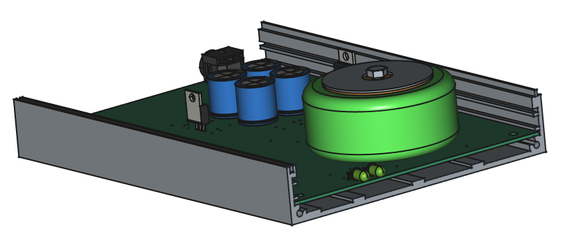

# Headphone amplifier

A headphone amplifier project consisting of the following parts:

* Amplifier PCB
* Amplifier front panel PCB
* Power supply PCB
* Annotated aluminium front panels
* 3D model of full assembly

## Power supply

